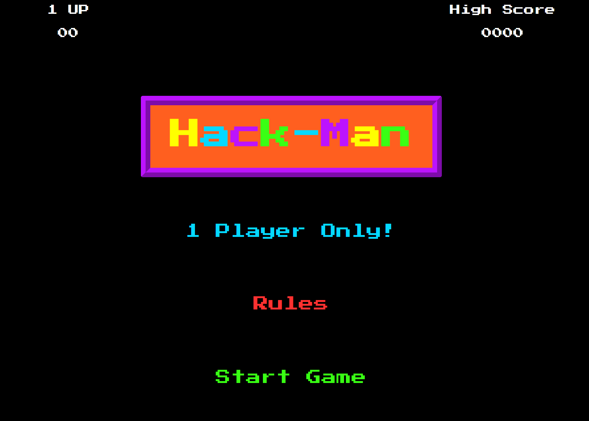
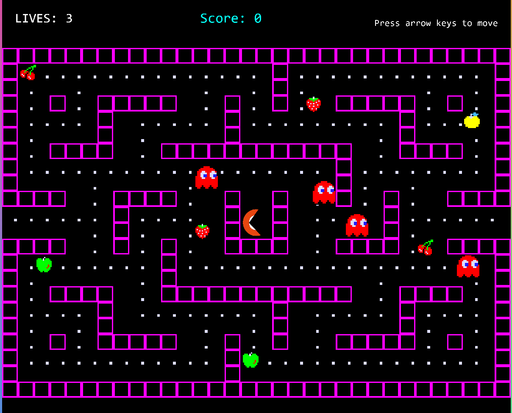

# Hack-Man

## Deployment

This project is deployed and can be accessed at [Hack-Man](https://joao4569.github.io/Hack-Man/).

## Criteria

- ✨ Our project is 100% front end based as required.
- ✨ Our game was inspired by the retro Namco classic Pac-Man.
- ✨ We have incorporated neon colors as well as 80's retro game music into our game as required by the judges.
- ✨ Our basic Readme.md file is completed as required.
- ✨ We made use of Kaboom.js as required by the judges.

## Intro

Hack-Man is a retro game based upon the concept of the 80s arcade video game Pac-Man.

Hack-Man was developed to be similar to the much-loved classic Pac-Man, with three main additions:
* Hack-Man has a unique appearance, based on the Code Institute logo.
* Retro gaming music plays in the background of the game.
* The game is styled throughout with neon colours to achieve a look reminiscent of 80s gaming.

The player must control the movement of Hack-Man around the maze, eating dots and fruit to gain points. The goal is to eat every dot whilst not getting caught by the enemy/ghosts.

The player begins the game with three lives and loses one life each time Hack-Man collides with a ghost. 

The game ends when all lives are lost.

The game is completed by eating all the dots in the maze.

## Goal

- ➡️ Problem Statement
* We are required to build a retro game, with neon colours and retro 80's music, using a JavaScript framework and front-end only development.

- ➡️ Objective(s)
* Our objective was to build a copy of the 80's classic Pac-Man, with a few twists to make it our own.
* We aimed to build a copy of the Pac-Man game with correctly functioning 'Hack-Man', dots and fruit to be eaten, ghosts who kill Hack-Man on collision, scoring system and tunnelling feature, where Hack-Man can leave and re-enter the maze.

- ➡️ Target Audience
* The game is built for people who enjoy retro gaming as well as fans of the original Pac-Man.
* The game can be enjoyed by anyone.

- ➡️ Benefits
* The benefits of the game are relaxation/recreation and entertainment.

## Controls / Game Play
 

* The arrow keys (up, down, left and right) are used to navigate Hack-Man through the maze. 
* When Hack-Man collides with a point dot, it disappears and 10 points are added to the score. 
* When Hack-Man collides with a fruit, it disappears and 100 points are added to the score. 
* When Hack-Man collides with an enemy (ghost), 100 points are deducted from the score and one of three lives are lost. A Kaboom explosion animation appears in the  enemy position.
* Hack-Man can tunnel from one side of the maze to the other.
* On collision with a wall, the enemy will bounce away from the wall, turn randomly and continue moving.

## Technologies Used
* HTML
* CSS
* JavaScript
* Bootstrap
* Kaboom JavaScript Framework

## Credits
We would like to give credit to the following individuals for their immense contributions:
- Johnny Rodrigues
- Jamie
- Jamie Bradford
- Helen Murugan
- Rowan
- Chisom Chioke

We would also like to thank the Code Institute's Hack Team for their valuable support and encouragement.

The music added to the game are free mp3 tracks taken from [Pixabay](https://pixabay.com/music/). The tracks are called cruising-down-8-bit-lane, neon-gaming, last-night and stay-retro.

A spritesheet was used to source the images for the maze-wall tiles, dots, fruit and ghosts and was taken from [The Spriters Resource](https://www.spriters-resource.com/arcade/pacman/).

The Hack-Man sprite was created by the development using the [Code Institute](https://codeinstitute.net/) logo.

